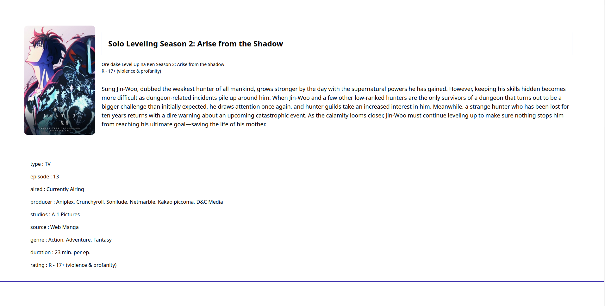

# personal-hobby-backlog

# Link

-[Live-preview](https://azanra.github.io/personal-hobby-backlog/)

# About

This project is focusing on displaying the object to the component,
how to pass a single or multiple data as a props. creating a component
that can be reused to display different data. using and configuring
the project to use tailwind instead of vanilla css for the layout and
basic styling and deploy it to github.

# Review

Having difficulty on passing the data to the component, using props and
defining it on the component with destructuring, and passing it kinda like
attribute of component. but for object i need to use a spread operator. i
can't have multiple spread operator for one component, because all of them
will be combined into a single object instead. Need more practiceon passing
more complex data and creating a list from data. Also why do i use object
constructor for the data, even though there is no method needed for the object,
i should use object literal or array to store a data instead.

# Screenshot

